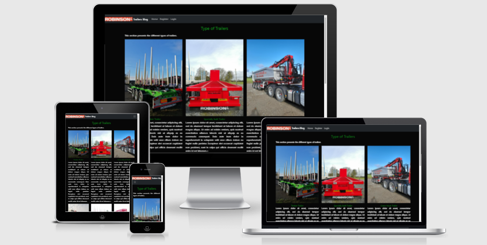

# Robinson Trailers Blog

A blog dedicated to a real trailers manufacturing company.

[View the live project here.](https://8000-fabrizioadi-robinsontrai-831gjxzl1vo.ws-eu31.gitpod.io/#)

## User Experience (UX)

### Project goals

### Business goals

### User Goals

### Site Owner goals

### Target audience

## User Stories
#### Visitor goals:

## Structure

1. Home
2. Contact

## Design 

1. Frameworks
The Bootstrap front-end framework is used through the project. Bootstrap provides a quick design, responsive grid system, extensive prebuilt components and a modern interface for the project.
2. Images
3. Fonts
4. Colour

## Existing Features

1. The Navbar
2. Home Page
3. Footer
4. Login/Logout
5. Register
6. Add and remove posts
7. Contact

#### Features left to implement in the future

## Technologies used

#### Languages

* Python 3.8 was used for backend of the project.
* HTML5 was used for building all web pages.
* jQuery is used for implementation of Bootstrap.
* CSS3 used for styling the website.
* JavaScript for alert and location fnunctionality.
* Jinja provides the templating language for Python.

#### Applications, Libraries and Platforms

* This project is built through the framework Django.
* GitPod is used to develop the project. All code was written and tested with the Gitpod web-based IDE.
* Git control system was used for version control to commit to Git and push to GitHub.
* GitHub projects repository is used to host the project.
* Heroku is used to host the project/Used to deploy the application.
* Bootstrap 5 as a framework used for styling.
* Pip3 is used for installing the necessary tools, libraries and frameworks.
* Spycopg2 is used to enable the PostGreSQL database to connect with Django.
* AWS Amazon used to store static and media files.(CSS and JavaScript)
* Boto3 is used for compatibility in AWS.
* Gunicorn is used to enable deployment to Heroku.
* Google Fonts is used to provide the font roboto for all the text that is used in the project.
* Font Awesome fonts were used for all icons in this project.
* Figma/Balsamiq used to create the mockup designs for the project. 
* Django Crispy Forms is used to style the Django forms
* Cloudinary - Cloud Platform used for images storage.

#### Databases

* PostgreSQL is used as the production database.
* SQlite3 is used as the development database.

## Validation

* Chrome DevTools is used to detect problems and test responsiveness.
* Autoprefixer is used to parse the CSS and to add vendor prefixes to CSS rules.
* W3C Markup Validation Service is used to check whether there were any errors in the HTML5 code.
* W3C CSS validator is used to check whether there were any errors in the CSS3 code.
* JShint is a JavaScript validator that is used to check whether there were any errors in the JavaScript code.
* PEP8 validator is used to check whether there were any errors in the Python code.

1. PEP8 Validation

2. HTML Validation

3. CSS Validation

4. Performance/Accessibility

5. Devices

6. Testing for User Stories

## Deployment

#### GitHub Repository

1. Access your GitHub account and find the relevant repository.
2. Click on 'Fork' on the top right of the page.
3. You will find a copy of the repository in your own Github account.

#### Making a Local Clone

1. Access your GitHub account and find the relevant repository.
2. Click the 'Code' button next to 'Add file'.
3. To clone the repository using HTTPS, under clone with HTTPS, copy the link.
4. Open Git Bash.
5. Access the directory you want the clone to be have.
6. In your IDE's terminal type 'git clone' and the paste the URL you copied.
7. Press Enter.
8. You now have a local clone.

#### Heroku  Deployment

1. Create an account at heroku.com
2. Create a new app, add app name and your region
3. Click on create app
4. Go to "Settings"
5. Under Config Vars, add your sensitive data (creds.json for example)
6. For this project, I set buildpacks to and in that order.
7. Go to "Deploy" and at "Deployment method", click on "Connect to Github"
8. Enter your repository name and click on it when it shows below
9. Choose the branch you want to buid your app from
10. If desired, click on "Enable Automatic Deploys", which keeps the app up to date with your Github repository

#### AWS S3

1. Create an account at aws.amazon.com
2. Navigate to the IAM application and create a user and group
3. Set the AmazonS3FullAccess for the user and copy the AWS ACCESS and SECRET keys as config vars to your workspace and deployment environment
4. Create a new Bucket within the S3 application with an appropriate name.
5. Enable public access for your bucket so users can access and use the services on your website (upload, view, download, etc). More info can be read in the official documentation: https://aws.amazon.com/s3/

#### Google API

1. Login or create a Google account and navigate to https://console.cloud.google.com/
2. Create a new Project by clicking on the New Project icon
3. Add Project name and details
4. Under API's and services, enable the relevant API for your project (in this case Google Drive, Sheets and Calendar)
5. IF the API requires, create a credential (service account in this case) for your project
6. Save the API key as a secret in config vars in your workspace and deployment environment
7. Under API's and services, enable the relevant API for your project (in this case Google Drive, Sheets and Calendar)
8. Search for the needed tasks to be performed in the documentation for the specific API, for example here for the calendar API: Google Maps API Reference
9. Add them to your code.

## Credits

## Reference

Websites, movies that I used while working on the project.

[How to Create Login System](https://www.youtube.com/watch?v=1UvTNMH7zDo)

[Simple Blog App Tutorial](https://www.youtube.com/watch?v=AF4ji8bb1M8&t=3399s)

[React Blog Tutorial](https://www.youtube.com/watch?v=tlTdbc5byAs)

[Ecommerce Store](https://www.youtube.com/watch?v=UqSJCVePEWU&list=PLOLrQ9Pn6caxY4Q1U9RjO1bulQp5NDYS_)

